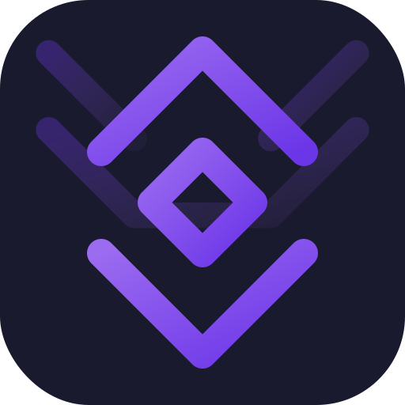

<p align="center">
  
</p>

<h1 align="center">Hermes Relay</h1>

<p align="center">
  Native Android client for the Hermes agent platform.<br>
  Chat, control, and connect — one app for your AI agent.
</p>

<p align="center">
  <a href="https://opensource.org/licenses/MIT"></a>
  <a href="https://developer.android.com"></a>
  <a href="https://github.com/Codename-11/hermes-android/actions/workflows/ci.yml"></a>
  <a href="https://developer.android.com/about/versions/oreo"></a>
</p>

<p align="center">
  <a href="https://hermes-agent.nousresearch.com">Hermes Agent</a> ·
  <a href="docs/spec.md">Specification</a> ·
  <a href="docs/decisions.md">Architecture Decisions</a> ·
  <a href="CHANGELOG.md">Changelog</a>
</p>

---

## What is Hermes Relay?

A native Android app for [Hermes Agent](https://github.com/NousResearch/hermes-agent). Three channels in one app:

| Channel | Protocol | What |
|---------|----------|------|
| **Chat** | HTTP/SSE | Stream conversations directly to the Hermes API Server |
| **Terminal** | WSS | Secure remote shell access via tmux (Phase 2) |
| **Bridge** | WSS | Agent controls the phone — taps, types, screenshots (Phase 3) |

Chat connects directly to the Hermes API Server (`/api/sessions/{id}/chat/stream`). Terminal and bridge use a WebSocket relay with channel multiplexing.

## Architecture

```
Phone (HTTP/SSE) → Hermes API Server (:8642)   [chat — direct]
Phone (WSS)      → Relay Server (:8767)          [terminal]
Phone (WSS)      → Bridge Relay (:8766)          [bridge]
```

Chat bypasses the relay entirely — same direct connection used by Open WebUI, ClawPort, and other Hermes frontends. Auth is via optional Bearer token (`API_SERVER_KEY`). The relay handles channels that need persistent bidirectional communication.

## Features

| Layer | Capabilities |
|-------|-------------|
| **Chat** | Direct API streaming (SSE), session management, auto-titles, personality picker (8 styles) |
| **Rendering** | Full markdown, syntax-highlighted code blocks (Atom theme), reasoning display |
| **Tools** | Rich progress cards with type-specific icons, arguments, duration, error display |
| **Tokens** | Per-message input/output counts and estimated cost |
| **Security** | EncryptedSharedPreferences (AES-256-GCM), HTTPS enforced, cleartext only for localhost |
| **Connectivity** | Network monitoring, auto-reconnect, capability detection (enhanced/portable/disconnected) |

## Repository Structure

```
hermes-android/
├── app/                       # Android app (Kotlin + Jetpack Compose)
├── relay_server/              # WSS relay server (Python + aiohttp)
├── plugin/                    # Hermes agent plugin (14 android_* tools)
├── user-docs/                 # VitePress documentation site
├── docs/                      # Spec, decisions, security
├── scripts/                   # Dev helper scripts
├── .github/workflows/         # CI + release pipelines
└── gradle/                    # Wrapper (8.13) + version catalog
```

## Quick Start

### Open in Android Studio

1. **File > Open** the repo root
2. Wait for Gradle sync
3. **Run** (Shift+F10) to deploy to emulator or device

### Dev Scripts

```bash
scripts/dev.bat build      # Build debug APK
scripts/dev.bat run        # Build + install + launch + logcat
scripts/dev.bat test       # Run unit tests
scripts/dev.bat relay      # Start relay server (dev, no TLS)
scripts/dev.bat devices    # List connected devices
scripts/dev.bat wireless   # Pair for wireless debugging
```

### Start Relay Server

```bash
pip install -r relay_server/requirements.txt
python -m relay_server --no-ssl --log-level DEBUG
```

### Install as Hermes Plugin

```bash
cp -r plugin ~/.hermes/plugins/hermes-android
# Restart hermes — /plugins should show: hermes-android (14 tools)
```

## Tech Stack

| Component | Stack |
|-----------|-------|
| **Android App** | Kotlin 2.0, Jetpack Compose, Material 3, OkHttp |
| **Relay Server** | Python 3.11+, aiohttp |
| **Serialization** | kotlinx.serialization |
| **Build** | AGP 8.13, Gradle 8.13, JVM toolchain 17 |
| **CI/CD** | GitHub Actions (lint, build, test, APK artifact) |
| **Min SDK** | 26 (Android 8.0) / Target SDK 35 |

## Current State

| Phase | Status | Scope |
|-------|--------|-------|
| **Phase 0** | Complete | Compose scaffold, WSS connection, channel multiplexer, auth |
| **Phase 1** | Complete | Direct API chat, sessions, markdown, tools, personalities, tokens |
| **Phase 2** | Next | Terminal channel (xterm.js + tmux) |
| **Phase 3** | Next | Bridge channel (AccessibilityService) |

See [docs/spec.md](docs/spec.md) for the full specification and [docs/decisions.md](docs/decisions.md) for architecture rationale.

## Documentation

| | |
|---|---|
| [Specification](docs/spec.md) | Full spec — protocol, UI, phases, dependencies |
| [Architecture Decisions](docs/decisions.md) | ADRs — framework, channels, auth, terminal |
| [Security](docs/security.md) | Auth flow, encryption, network security |
| [Changelog](CHANGELOG.md) | Release history |
| [Dev Log](DEVLOG.md) | Session-by-session development notes |

## Related Projects

| Project | What |
|---------|------|
| [Hermes Agent](https://github.com/NousResearch/hermes-agent) | The agent platform (gateway, WebAPI, plugins) |
| [ARC](https://github.com/Codename-11/ARC) | Agent Runtime Control — unified CLI for agent tools |
| [ClawPort](https://github.com/Codename-11/clawport-ui) | Web dashboard for Hermes Agent |

## License

[MIT](LICENSE) — Copyright (c) 2026 [Axiom-Labs](https://axiom-labs.cloud)

---

<p align="center">
  Built with the help of Humans and AI Agents<br><br>
  <a href="https://ko-fi.com/L4L31Q8LJ1"></a>
</p>
