<p align="center">
  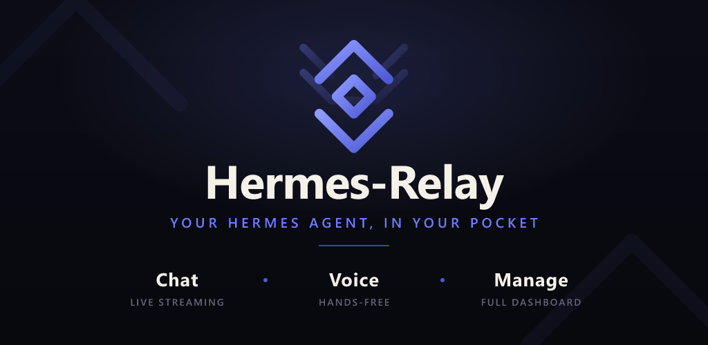
</p>

<p align="center">
  <strong>Runs on your machine. Lives on your devices.</strong><br>
  A native Android companion for your <a href="https://github.com/NousResearch/hermes-agent">Hermes agent</a> — streaming chat, hands-free voice,
  and full agent management. Plus a single-binary CLI that gives the agent hands on any machine you pair.
</p>

<p align="center">
  <a href="https://play.google.com/store/apps/details?id=com.axiomlabs.hermesrelay"></a>
</p>

<p align="center">
  <a href="https://opensource.org/licenses/MIT"></a>
  <a href="https://developer.android.com/about/versions/oreo"></a>
  <a href="https://github.com/Codename-11/hermes-relay/actions/workflows/ci-android.yml"></a>
  <a href="https://github.com/Codename-11/hermes-relay/releases"></a>
  <a href="https://github.com/Codename-11/hermes-relay/tree/main/desktop"></a>
</p>

<p align="center">
  <strong>English</strong> · <a href="README.zh-CN.md">简体中文</a><br>
  <a href="https://codename-11.github.io/hermes-relay/">Documentation</a> ·
  <a href="https://github.com/Codename-11/hermes-relay/releases">Releases</a> ·
  <a href="CHANGELOG.md">Changelog</a> ·
  <a href="https://hermes-agent.nousresearch.com">Hermes Agent</a>
</p>

---

## What it is

Hermes-Relay puts your [Hermes agent](https://github.com/NousResearch/hermes-agent) on the devices you actually carry. The brain stays on your own machine — Hermes-Relay is how you reach it.

- **📱 Android app** — streaming chat, hands-free voice, and the full Hermes dashboard (models, keys, skills, profiles), rebuilt native. On sideload builds, the agent can read your screen and act on it.
- **⌨️ Hermes-Relay CLI** *(alpha)* — a single binary that gives the agent **hands on any machine you pair**: files, terminal, search, screenshots — consent-gated.

A vanilla [hermes-agent](https://github.com/NousResearch/hermes-agent) install is enough — chat, management, and voice need **no plugin**. Add the optional relay only when you want terminal, phone control, or the CLI's tools. **Pair once from either surface; both work.**

<p align="center">
  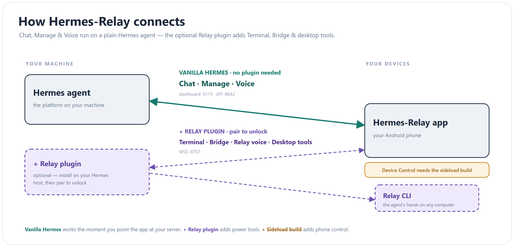
</p>

## Quick Start (Android)

Install → connect → talk, in about two minutes.

### 1 · Install the app

- **Google Play** *(easiest — auto-updates)* — [**install from Google Play**](https://play.google.com/store/apps/details?id=com.axiomlabs.hermesrelay). Chat, voice, Manage, terminal/TUI, media, notifications, and relay sessions.
- **APK** *(full phone-control feature set)* — download the file ending in **`-sideload-release.apk`** from the newest `android-v*` release on [GitHub Releases](https://github.com/Codename-11/hermes-relay/releases) and open it (allow your browser to install unknown apps the first time). Integrity verification, signing fingerprint, and per-build details are in the [Sideload guide](https://codename-11.github.io/hermes-relay/guide/getting-started.html#sideload-apk).

Sideload builds check GitHub for updates and show a one-tap banner when you're behind; Play builds update through the Store. See [Release tracks](https://codename-11.github.io/hermes-relay/guide/release-tracks) for the capability matrix.

### 2 · Have Hermes running

The app needs your Hermes **API server enabled and reachable from your phone**, plus an **API key** — the token the app sends to authenticate Chat (pick any value you like). Installing Hermes and choosing a provider is vanilla Hermes setup; the [full walkthrough](https://codename-11.github.io/hermes-relay/guide/getting-started) covers Windows, the dashboard for **Manage**, LAN scan, and QR setup.

```bash
hermes setup --portal                      # install / log in / pick a provider — skip if already done

mkdir -p ~/.hermes
API_SERVER_KEY="$(openssl rand -hex 32)"   # strong random key — or substitute your own memorable value
cat >> ~/.hermes/.env <<EOF
API_SERVER_ENABLED=true
API_SERVER_HOST=0.0.0.0
API_SERVER_PORT=8642
API_SERVER_KEY=$API_SERVER_KEY
EOF
chmod 600 ~/.hermes/.env

echo "Android API URL: http://<this-computer-ip>:8642   key: $API_SERVER_KEY"
hermes gateway
```

`API_SERVER_ENABLED` turns the API server on; `API_SERVER_HOST=0.0.0.0` makes it reachable on your LAN (the default is localhost-only); `API_SERVER_KEY` is the bearer token the app sends — **your choice of value**.

> **Heads up on `0.0.0.0`:** that exposes the API to every device on your network — fine on a trusted home LAN, but off it keep the key set and front it with Tailscale or an HTTPS reverse proxy ([Remote access](https://codename-11.github.io/hermes-relay/guide/remote-access)) rather than exposing it directly. You don't have to type the key on your phone — **Scan for Hermes on LAN**, or have your agent make a setup QR (below). For **Manage** (skills, models, keys), also run the Hermes dashboard — see [Getting Started](https://codename-11.github.io/hermes-relay/guide/getting-started).

### 3 · Connect and talk

Open the app and pick how to connect — any of:

- **Vanilla Hermes** → tap **Scan for Hermes on LAN** to auto-find the server, then enter your key.
- **Vanilla Hermes** → type the address (`http://<host>:8642`) and key by hand.
- **Scan setup QR** → ask your Hermes agent to generate a QR with your URL + key (e.g. `{"api_url":"http://<host>:8642","api_key":"<key>","dashboard_url":"http://<host>:9119"}`) and scan it. `dashboard_url` is optional when the dashboard uses the conventional same-host `:9119` URL.

The wizard probes everything and finishes with a capability card:

| Line | What it means |
|------|---------------|
| **Chat** | API server reachable — you can talk |
| **Manage** | Dashboard found — models, keys, skills, profiles from the phone |
| **Voice** | Speech ready via your server (or one Manage sign-in away) |
| **Remote** | Fallback route configured — keeps working away from home |
| **Relay** | Optional power tools — fine to leave unpaired |

If your dashboard requires sign-in, do it once under the **Manage** tab — the same session unlocks voice. That's the whole Vanilla Hermes setup.

> **Going places?** Put your server's Tailscale URL in the setup form's *Remote access* field (or add a route any time under **Settings → Connections → Routes**). The app uses LAN at home and switches routes automatically when you leave. See [Remote access](https://codename-11.github.io/hermes-relay/guide/remote-access).

### 4 · Optional: install Relay for power tools

Install the Relay plugin on the server only when you want Terminal, Bridge phone control, relay sessions, media routes, or the realtime voice engine:

```bash
hermes plugins install Codename-11/hermes-relay/plugin --enable
hermes relay doctor
hermes relay start --no-ssl
hermes pair
```

Use the legacy installer instead if you also want the systemd user service,
shell shims, and the full clone/update workflow:

```bash
curl -fsSL https://raw.githubusercontent.com/Codename-11/hermes-relay/main/install.sh | bash
```

The plugin-manager install owns the plugin code, dashboard tab, CLI commands,
and agent tools. `hermes relay compat status/install/remove` manages only the
optional legacy API compatibility hook when an older Hermes build needs it. Scan
the QR from the phone's Connections screen — or use
`hermes pair --register-code ABCD12` with the manual code from Android
**Settings → Connections → Advanced**.

- **Plugin-manager uninstall:** `hermes relay compat remove --all` if you installed the optional hook, then `hermes plugins remove hermes-relay`.
- **Legacy installer update:** `hermes-relay-update` (idempotent) — or re-run the install one-liner.
- **Legacy installer uninstall:** `bash ~/.hermes/hermes-relay/uninstall.sh` — removes the service, shims, clone, external skill path, editable package, and compat hook. It never touches shared Hermes state. Flags: `--dry-run`, `--keep-clone`, `--remove-secret`.
- **Dashboard plugin:** installs with the same symlink — restart the gateway and a **Relay** tab (paired devices, bridge activity, media tokens) appears in the web UI.

Full server setup, TLS, and systemd details: [docs/relay-server.md](docs/relay-server.md).

**Requirements:** Android 8.0+ (SDK 26) · current upstream [hermes-agent](https://github.com/NousResearch/hermes-agent) with the API server and dashboard enabled · Python 3.11+ on the server.

## Screenshots

<table>
  <tr>
    <td align="center" width="25%">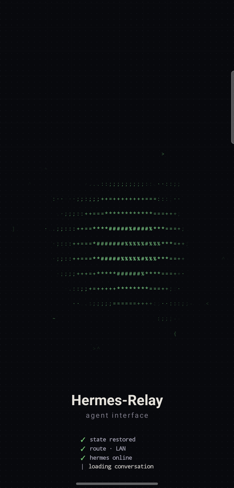<br><sub><b>Cold start</b></sub></td>
    <td align="center" width="25%">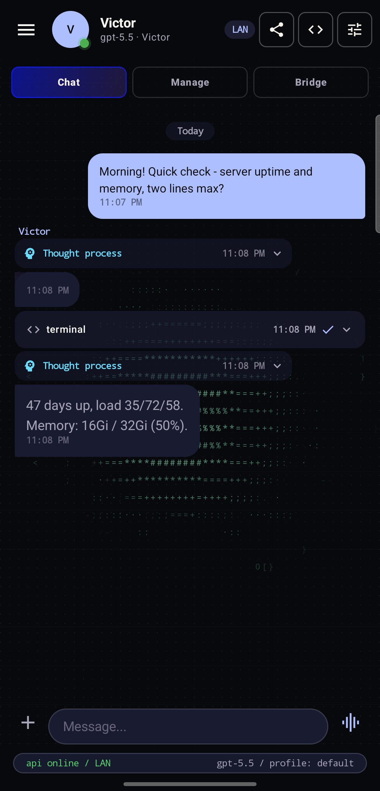<br><sub><b>Streaming chat</b></sub></td>
    <td align="center" width="25%">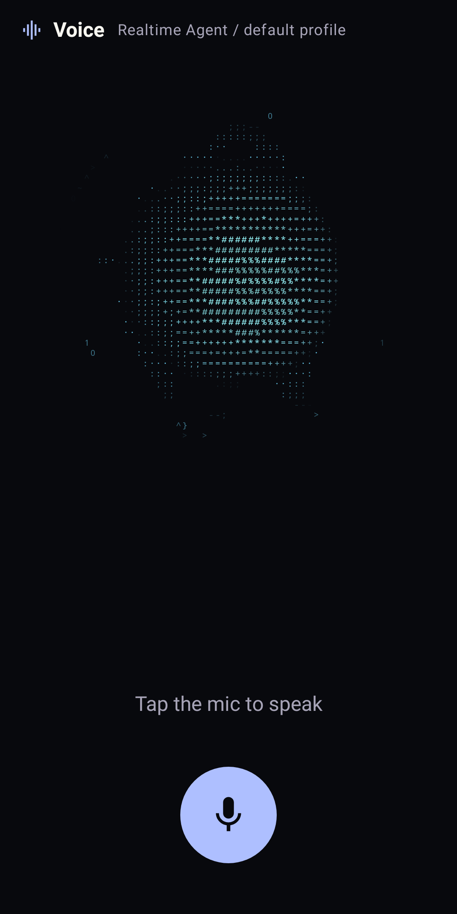<br><sub><b>Hands-free voice</b></sub></td>
    <td align="center" width="25%">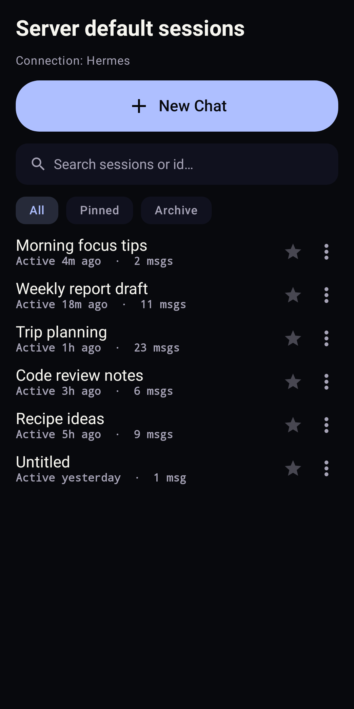<br><sub><b>Session history</b></sub></td>
  </tr>
  <tr>
    <td align="center" width="25%">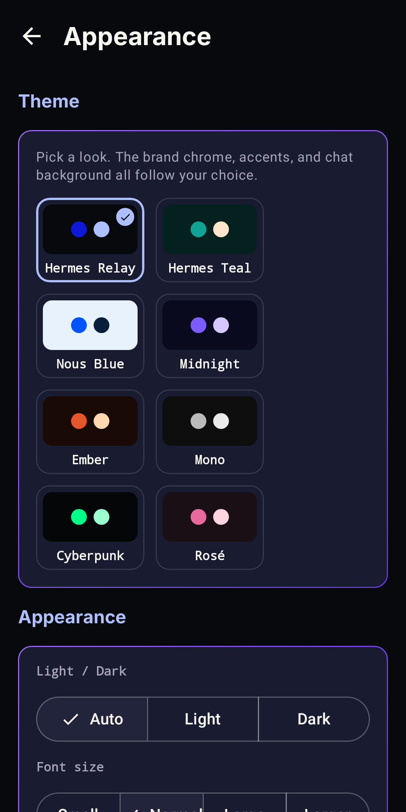<br><sub><b>App themes</b></sub></td>
    <td align="center" width="25%">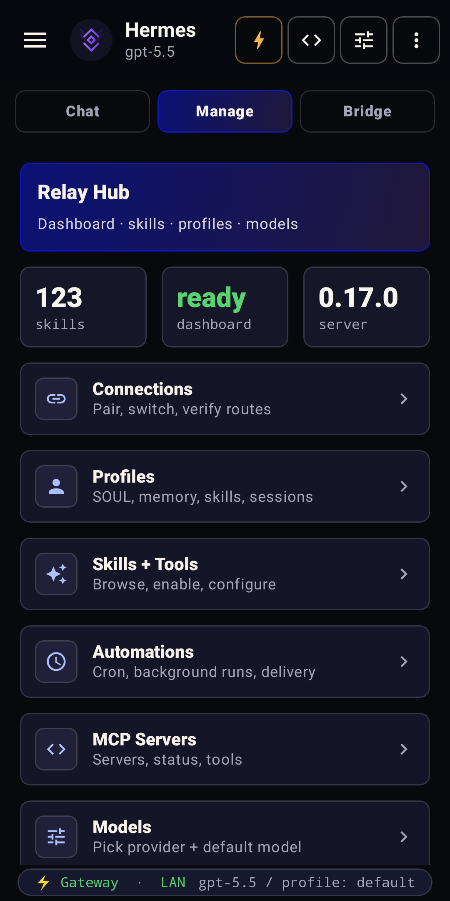<br><sub><b>Manage your agent</b></sub></td>
    <td align="center" width="25%">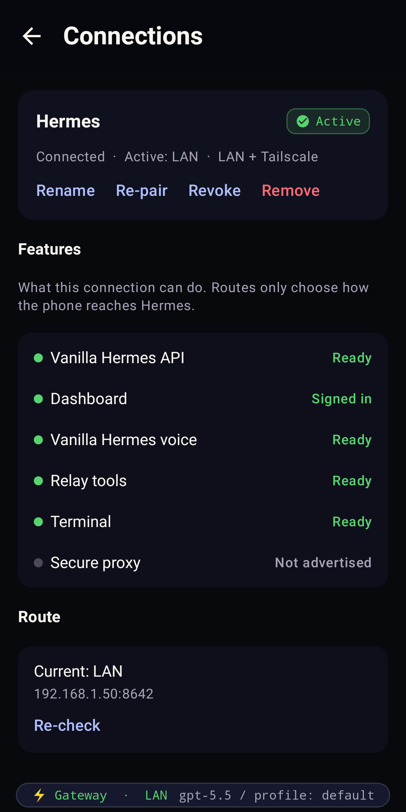<br><sub><b>Connections &amp; routes</b></sub></td>
    <td align="center" width="25%">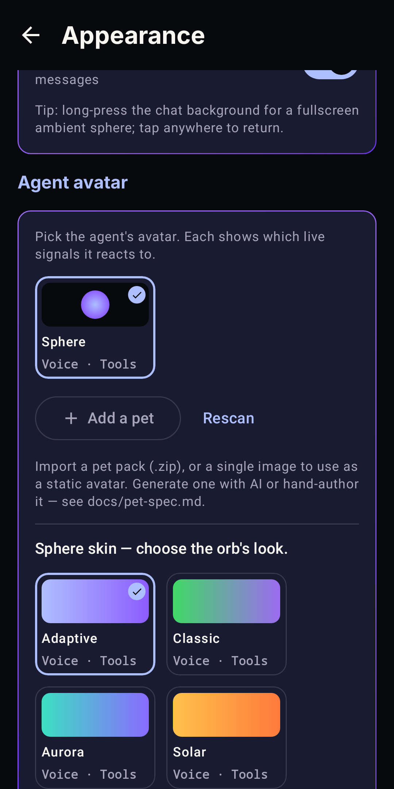<br><sub><b>Avatars &amp; skins</b></sub></td>
  </tr>
</table>

### Simplified Chinese

<table>
  <tr>
    <td align="center" width="33%">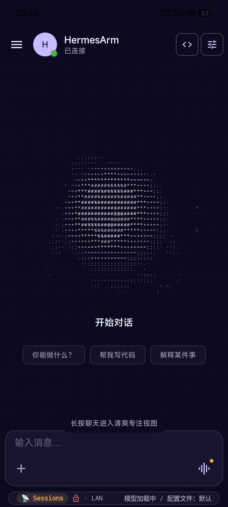<br><sub><b>设置 — 全面汉化</b></sub></td>
    <td align="center" width="33%">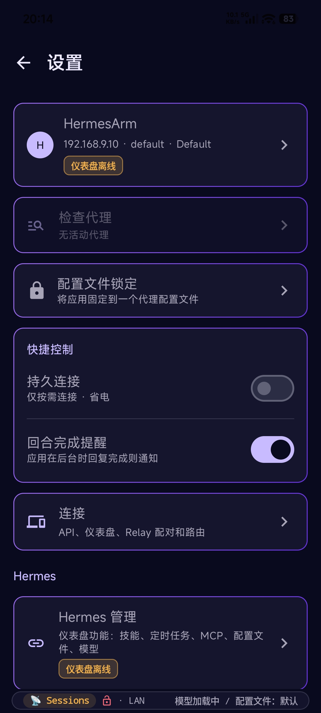<br><sub><b>管理 — 仪表盘汉化</b></sub></td>
    <td align="center" width="33%">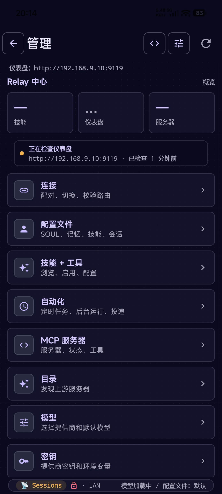<br><sub><b>导航菜单 — 简体中文</b></sub></td>
  </tr>
</table>

The Android app also ships a complete AI-assisted Spanish catalog. Choose
**Español** from **Settings → Appearance → Language**; translation status and
fluent review are tracked independently so community corrections remain easy
to contribute.

<p align="center"><sub>▶ <a href="https://codename-11.github.io/hermes-relay/guide/getting-started.html#see-it-working">Watch the demo</a> on the docs site</sub></p>

## Features

### Android

- **Streaming chat** — rides vanilla Hermes, preferring the dashboard gateway (`/api/ws`, live thinking) when signed in to Manage and falling back to API-server SSE otherwise, with live markdown, tool-call cards, session history, a searchable command palette, file attachments, quote-in-reply, conversation share, and send-while-streaming queuing.
- **Manage your agent** — the full Hermes dashboard, native: switch models from your provider catalog, manage keys (write-only, masked, rate-limited reveal), create and edit profiles including `SOUL.md`, and browse/install/update skills. One dashboard sign-in covers it all.
- **Hands-free voice** — talk on a vanilla install: speech rides your server's configured providers, unlocked by the same Manage sign-in. Relay-paired setups add per-profile voice and an opt-in provider-native Realtime Agent with background task handoff.
- **Works away from home** — add a Tailscale or public URL and the app roams automatically (LAN at home, fallback elsewhere). An unreachable server gets a diagnosis, not just a red dot.
- **Multi-Connection + profiles** — pair multiple Hermes servers (home + work, dev + prod) and switch in one tap; overlay a profile's model + `SOUL.md` per chat.
- **Phone control (bridge)** — with Relay paired, the agent reads the screen and acts: tap, type, swipe, scroll, screenshots, clipboard, media keys, batched macros. Guarded by per-app blocklist (banking/2FA blocked by default), destructive-verb confirmation, idle auto-disable, and a full activity log.
- **Notification companion** — opt-in access so the agent can triage, summarize, and route incoming notifications.
- **Security & pairing** — QR pairing, Android Keystore session storage (StrongBox-preferred), TOFU cert pinning, per-channel time-bound grants, user-chosen session TTL.
- **Stats for Nerds** — local-only analytics: TTFT, token usage, stream health, peak-time charts.

> Sideload builds add direct SMS, contact search, one-tap dialing, and location awareness — handy for fully hands-free intents like *"text Sam I'll be 10 minutes late."* See [Release tracks](https://codename-11.github.io/hermes-relay/guide/release-tracks).

## Hands on any machine — the Hermes-Relay CLI&nbsp;<sub>(alpha)</sub>

> **Alpha.** Self-contained CLI binaries ship for Windows x64, Linux x64, and macOS x64/arm64 — no Node required. Windows also has an optional native, menu-only systray. Assets are unsigned during the experimental phase, so SmartScreen / Gatekeeper warnings are expected.

The agent's brain stays on the host; the CLI lets it call tools **on your machine** over the same WSS relay — `read_file`, `write_file`, `terminal`, `search_files`, `screenshot`, `clipboard`, `open_in_editor`, and more — behind a one-time consent gate, interactive diff approval for patches, and a `--no-tools` kill-switch.

```powershell
irm https://raw.githubusercontent.com/Codename-11/hermes-relay/main/desktop/scripts/install.ps1 | iex
```

```bash
hermes-relay pair --remote ws://<host>:8767   # once
hermes-relay daemon start                      # background tool router — agent reaches you anytime
hermes-relay update                            # self-update via GitHub Releases
```

It pairs against the **same relay and credential store** as the Android app — pair once from either, both work. Tagged on the `desktop-v*` [release track](https://github.com/Codename-11/hermes-relay/releases?q=desktop), with historical releases still visible under `cli-v*`.

On Windows, the default installer adds the optional right-click-only systray: no dashboard or app window, just TUI launch, User/Administrator-aware daemon controls, pairing, local grant review, audit, diagnostics, logs, desktop-use status/cancellation, sign-in startup, and emergency stop.

- **Docs:** [CLI guide](https://codename-11.github.io/hermes-relay/desktop/) · [`desktop/README.md`](desktop/README.md)
- **AI-agent setup recipe:** `/hermes-relay-desktop-setup`

## How It Works

```
Phone        (HTTP/WSS) --> Hermes Dashboard  (:9119)   [chat gateway, manage, vanilla voice]
Phone        (HTTP/SSE) --> Hermes API Server (:8642)   [chat fallback, sessions, runs]
Phone        (WSS/HTTP) --> Relay             (:8767)   [terminal, bridge, media, relay voice, sessions]
CLI          (WSS)      --> Relay             (:8767)   [machine tools, tui, terminal]
```

Chat prefers the Hermes dashboard gateway when Manage auth is ready, then falls
back to the upstream API server SSE path with the API key. Manage and Vanilla Hermes
voice ride the Hermes dashboard with its own one-time sign-in, so a vanilla
install needs no plugin for either. The optional relay on `:8767` adds the power
surfaces: terminal, bridge phone control, media handoff, machine tools, and
relay-side voice, which is preferred automatically when paired. One QR can
configure API, dashboard, and relay routes without merging their auth models.

## Documentation

| | |
|---|---|
| **[User Guide](https://codename-11.github.io/hermes-relay/)** | **Quick start, features, configuration — start here** |
| [Android](https://codename-11.github.io/hermes-relay/guide/) | Android install + setup + features |
| [Hermes-Relay CLI](https://codename-11.github.io/hermes-relay/desktop/) | Pairing, subcommands, local tool routing |
| [Architecture](https://codename-11.github.io/hermes-relay/architecture/) | How the system works under the hood |
| [API Reference](https://codename-11.github.io/hermes-relay/reference/api.html) | Hermes API endpoints used by both surfaces |
| [Specification](docs/spec.md) | Full spec — protocol, UI, phases, dependencies |
| [Architecture Decisions](docs/decisions.md) | ADRs — framework, channels, auth, terminal |
| [Changelog](CHANGELOG.md) | Release history (`android-v*`, `server-v*`, `desktop-v*`; historical prefixes remain immutable) |

<details>
<summary><b>Install with an AI agent</b> — paste-ready prompt for Claude / GPT</summary>

<br>

If an AI assistant manages your server, paste this block into its chat and it will fetch the canonical setup recipe and walk you through install, pairing, and troubleshooting:

```text
You are helping me install and maintain Hermes-Relay (https://github.com/Codename-11/hermes-relay) — a native Android client + a CLI + a Python plugin for the Hermes AI agent platform.

Read the canonical setup recipe before acting:
  https://raw.githubusercontent.com/Codename-11/hermes-relay/main/skills/devops/hermes-relay-self-setup/SKILL.md

Then guide me through:
- Verifying hermes-agent is already installed (it's a prerequisite — Hermes-Relay is a plugin, not standalone)
- Running the server-plugin install one-liner: `curl -fsSL https://raw.githubusercontent.com/Codename-11/hermes-relay/main/install.sh | bash`
- Connecting my phone by Vanilla Hermes API URL/key first, then optionally pairing Relay via `hermes pair` or `/hermes-relay-pair` for power tools; OR pairing my laptop via the Hermes-Relay CLI (`irm https://raw.githubusercontent.com/Codename-11/hermes-relay/main/desktop/scripts/install.ps1 | iex` on Windows, then `hermes-relay pair --remote ws://<host>:8767`)
- Verifying with `hermes-status` (server) or `hermes-relay doctor` (CLI)

Always confirm before running shell commands. Never restart hermes-gateway without asking. If any step fails, consult the Troubleshooting section in the SKILL.md and ask me for the exact error.
```

Already installed? The same recipe is auto-loaded as a Hermes skill — invoke `/hermes-relay-self-setup` from any chat for re-setup or "is everything wired correctly?" checks.

</details>

## Development

```bash
# Android: open the repo root in Android Studio, wait for Gradle sync, Run (Shift+F10).
scripts/dev.bat build      # Build debug APK
scripts/dev.bat release    # Build signed release APK
scripts/dev.bat bundle     # Build release AAB for Google Play
scripts/dev.bat run        # Build + install + launch + logcat
scripts/dev.bat test       # Run unit tests
scripts/dev.bat version    # Show current version
scripts/dev.bat relay      # Start the relay server (dev, no TLS)
```

### Tech Stack

| Component | Stack |
|-----------|-------|
| **Android app** | Kotlin 2.0, Jetpack Compose, Material 3, OkHttp |
| **Hermes-Relay CLI** | TypeScript, Bun-compiled native binary, Node ≥21 (source/dev), zero runtime deps |
| **Server / plugin** | Python 3.11+, aiohttp |
| **Serialization** | kotlinx.serialization (Android) |
| **Build** | AGP 9, Gradle 8.13, JVM toolchain 17 (Android); `tsc` + `bun build --compile` (CLI) |
| **CI/CD** | GitHub Actions — lint, build, test, APK artifact, CLI binaries per platform |
| **Min SDK** | 26 (Android 8.0) · Target SDK 35 |

<details>
<summary><b>Repository structure</b></summary>

```
hermes-relay/
├── app/                       # Android app (Kotlin + Jetpack Compose)
├── desktop/                   # Hermes-Relay CLI thin-client (TS + Bun-compiled binary)
├── relay_server/              # WSS server (Python + aiohttp; thin shim → plugin/relay)
├── plugin/                    # Hermes agent plugin
│   ├── relay/                 #   - canonical relay (server.py, channels/, media, voice, machine tools)
│   ├── tools/                 #   - android_* bridge + desktop_* tool handlers
│   └── pair.py                #   - QR pairing CLI + multi-endpoint payload builder
├── skills/devops/             # Hermes agent skills (pairing, self-setup, CLI setup recipes)
├── user-docs/                 # VitePress documentation site
├── docs/                      # Spec, decisions, security
├── scripts/                   # Dev helper scripts
├── .github/workflows/         # CI + release pipelines (ci-android / ci-plugin / ci-desktop)
└── gradle/                    # Wrapper (8.13) + version catalog
```

</details>

<details>
<summary><b>Running the server / plugin from a clone</b></summary>

<br>

End users should install via the [one-liner](#4--optional-install-relay-for-power-tools) above. For local development:

```bash
hermes relay start --no-ssl          # if you installed the plugin
python -m plugin.relay --no-ssl      # or from a repo checkout

# Docker:
docker build -t hermes-relay relay_server/ && docker run -d --network host --name hermes-relay hermes-relay

# Live-edit the plugin against a local Hermes:
ln -s "$PWD/plugin" ~/.hermes/plugins/hermes-relay
```

Then restart hermes and run `hermes pair` to verify. The 35 `android_*` and 25 `desktop_*` tools register regardless of hermes-agent version. See [docs/relay-server.md](docs/relay-server.md) for TLS, systemd, and full setup.

</details>

## Built for Hermes Agent

Hermes-Relay is built for [Hermes Agent](https://github.com/NousResearch/hermes-agent) — an open-source AI agent platform by [Nous Research](https://nousresearch.com). See the [Hermes Agent docs](https://hermes-agent.nousresearch.com) for server setup, gateway configuration, and plugin development.

## Found a bug? Let us know

This is an indie project and every report helps shape where it goes next. If something feels off, broken, or just weird — [open an issue](https://github.com/Codename-11/hermes-relay/issues/new). We read every one, and even a one-line *"this didn't work on my Pixel 7"* is genuinely useful.

## Star History

<a href="https://www.star-history.com/?repos=Codename-11%2Fhermes-relay&type=date&legend=top-left">
 <picture>
   <source media="(prefers-color-scheme: dark)" srcset="https://api.star-history.com/chart?repos=Codename-11/hermes-relay&type=date&theme=dark&legend=top-left&sealed_token=LpoTO7nnGWAwvnRyEeMuKowbf1fe6tQP9n6EbjX-9HTG0uGPrSD_OaNkloMDIM5ugTCg_14LB3XpQTx7v4fBn7PAtMZhO87iIlK5lo42Z31x8myptmcmnQ" />
   <source media="(prefers-color-scheme: light)" srcset="https://api.star-history.com/chart?repos=Codename-11/hermes-relay&type=date&legend=top-left&sealed_token=LpoTO7nnGWAwvnRyEeMuKowbf1fe6tQP9n6EbjX-9HTG0uGPrSD_OaNkloMDIM5ugTCg_14LB3XpQTx7v4fBn7PAtMZhO87iIlK5lo42Z31x8myptmcmnQ" />
   
 </picture>
</a>

## License

[MIT](LICENSE) — Copyright (c) 2026 [Axiom-Labs](https://codename-11.dev)

---

<p align="center">
  Built with the help of Humans and AI Agents<br><br>
  <a href="https://ko-fi.com/L4L31Q8LJ1"></a>
</p>
