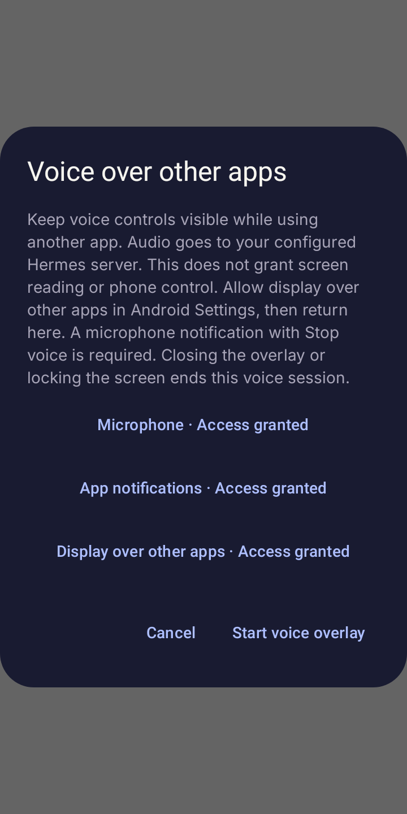
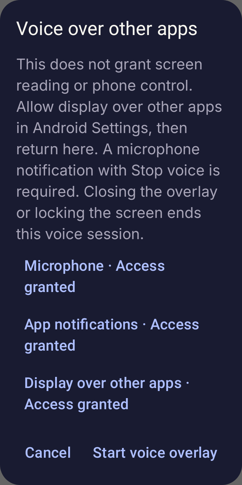
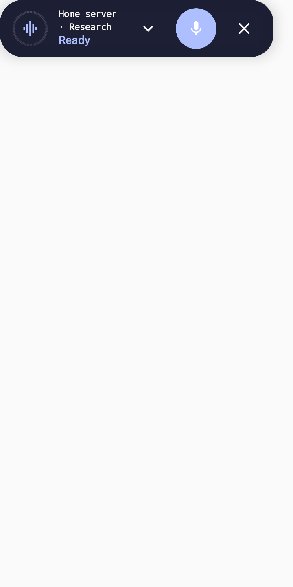
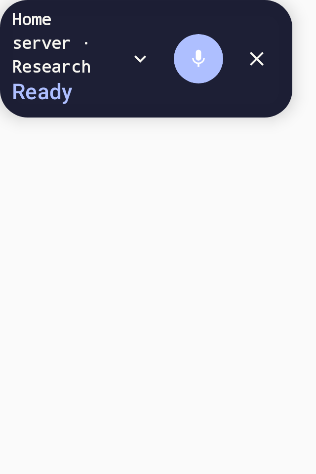
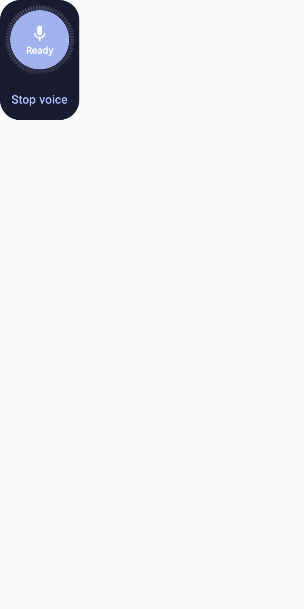

# Play voice overlay verification

The Google Play build adds user-started voice controls over other apps. This
does not enable Device Control, AccessibilityService, MediaProjection or phone
utility permissions. Standard voice keeps the upstream Dashboard/Gateway path.

## Session contract

- Permission setup explains the purpose before launching Android Settings.
  Permission grants do not start the overlay; Start requires a resumed, unlocked
  app with microphone, overlay and notification access.
- The microphone foreground service must successfully promote before the window
  attaches. Session identifiers reject stale starts, readiness and Stop actions.
- The existing voice runtime owns capture and microphone-release barriers. The
  service creates no recorder. Stop/close, screen lock, task removal, permission
  loss and failed startup terminate the voice session. Notification-channel
  revocation is checked at most one second later while the service is running.
- Returning to Hermes preserves foreground protection until the app resumes.
  No overlay session is restored after process death or started by boot, Relay
  commands or wake detection. Independent opt-in wake settings remain unchanged.

## Host verification

Run focused tests through the Windows Android lane:

```powershell
.\scripts\android-lane.ps1 gradle :app:testGooglePlayDebugUnitTest `
  --tests '*VoiceOverlay*Test' --tests '*VoiceModeOverlayInteractionTest' `
  --tests '*VoiceViewModelBargeInTest' --tests '*BargeInListenerShutdownRaceTest' `
  --console=plain
```

The new session/service tests exercise foreground eligibility, missing/revoked
access, stopped-before-ready sessions, old notification actions, failed foreground
promotion/window attachment, screen-off and task removal. Existing voice tests
cover the microphone handoff and shutdown race. The same new tests are included
in the both-flavor on-demand focused preset.

`scripts/check-android-capabilities.py` checks source overlays and the merged
Play debug/release manifests. Its mutation tests reject transitive sensitive
permissions, renamed accessibility services and exported overlay services.
CI debug/release builds and Play preflight run this check.

## Rendered controls

These are production Compose components rendered by Robolectric/Roborazzi on
API 35, with synthetic voice state. They are not physical microphone evidence.
Normal layout is 360 × 720 dp; narrow layout is 320 × 480 dp with 150% font size.
The permission dialog is also checked at 150%, including scrolling to the last
permission row while Start/Cancel remain reachable.







## Release validation

Physical-device tests and Play Console changes are separate release work. Before
production, validate real repeated microphone turns after backgrounding on Android
14–16, denial/revocation, task/process termination, screen lock, audio interruption,
network loss and OEM window behavior. Use the Standard Phone API 36 emulator lane
for the smallest relevant instrumentation run; device claims still require a real
device. Do not install an APK or submit a test-track build without authorization.

Update the microphone FGS declaration and demo for the actual Google Play package.
`scripts/android-fgs-demo.py` defaults to that package and requires permissions to
be granted manually before recording. Review Data Safety against real recipients,
retention and any applicable exceptions. Publish the corresponding canonical and
legacy privacy pages before stable preflight; the strengthened live checker
deliberately rejects the old blanket no-screen-access policy. See the
[submission requirements](../play-store-listing.md#voice-overlay-review-before-production).
