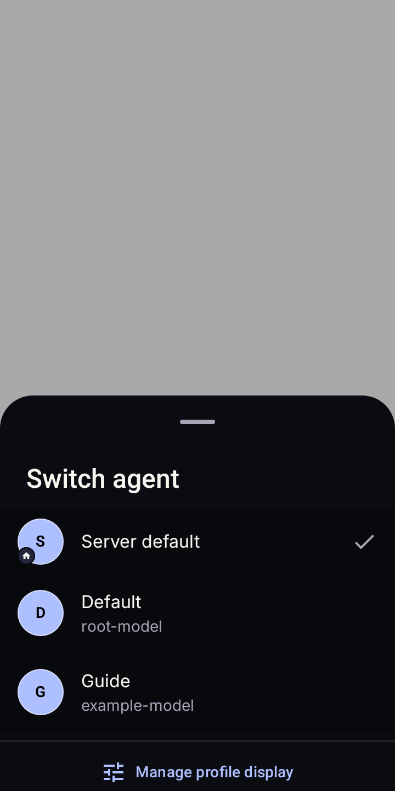
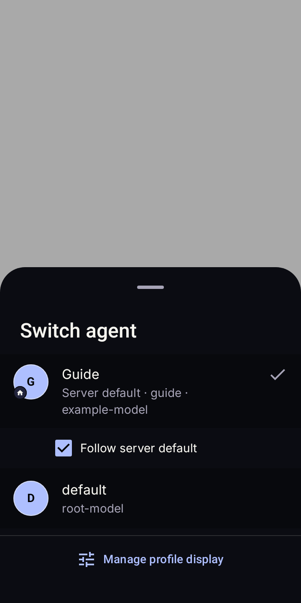

# Android profile identity audit

## Upstream contract

Source inspection used clean upstream commit
`b0c383cdf7d8e9e540087610324ec3bb89f3b250` from `NousResearch/hermes-agent`.

- [`hermes_cli/profiles.py`](https://github.com/NousResearch/hermes-agent/blob/b0c383cdf7d8e9e540087610324ec3bb89f3b250/hermes_cli/profiles.py):
  `default` is the reserved request name for the root Hermes home. Named profiles
  resolve beneath the profiles directory. `is_default` marks that root row; it
  does not identify the sticky selection. The active-profile marker is written
  atomically, and selecting root removes the marker. Profile `display_name` is
  presentation metadata in `profile.yaml`; renaming root changes that display
  metadata rather than moving its home.
- [`hermes_cli/web_routers/profiles.py`](https://github.com/NousResearch/hermes-agent/blob/b0c383cdf7d8e9e540087610324ec3bb89f3b250/hermes_cli/web_routers/profiles.py):
  `/api/profiles` returns `name`, `display_name`, `description`, and `is_default`.
  `/api/profiles/active` returns two different authorities: `active` is the sticky
  choice for new invocations, while `current` describes the running Dashboard.
- [`tui_gateway/methods_profiles.py`](https://github.com/NousResearch/hermes-agent/blob/b0c383cdf7d8e9e540087610324ec3bb89f3b250/tui_gateway/methods_profiles.py):
  `profiles.list` returns the same profile identity plus avatar/UI metadata.
  Standard Android requests `include_sessions:false`; Bot Mode retains the
  richer roster contract and its own optional Bot title.
- [`tui_gateway/methods_session.py`](https://github.com/NousResearch/hermes-agent/blob/b0c383cdf7d8e9e540087610324ec3bb89f3b250/tui_gateway/methods_session.py):
  explicit `profile` selects the profile home for session creation and resume.
  Omission uses launch context; it is not inherently a request for the sticky
  active profile. Android already resolves the sticky setting explicitly for
  standard profile-scoped sessions and retains that behavior.
- [`apps/desktop/src/store/profile.ts`](https://github.com/NousResearch/hermes-agent/blob/b0c383cdf7d8e9e540087610324ec3bb89f3b250/apps/desktop/src/store/profile.ts):
  `profileLabel` uses trimmed `display_name`, then the request name. TUI's
  [`appLayout.tsx`](https://github.com/NousResearch/hermes-agent/blob/b0c383cdf7d8e9e540087610324ec3bb89f3b250/ui-tui/src/components/appLayout.tsx)
  supplies session `profile_name` to its composer prompt rather than a server
  connection label.

The `active_status_profile_scope` scenario's current-upstream conformance check
passed against this SHA. This is source-only evidence, with no provider calls.

## Product decision

The agent name is Hermes `display_name`, otherwise the exact profile request
name. Descriptions are not identity. A connection name remains infrastructure
identity. Existing local aliases and personality fallback remain supported; an
otherwise unknown agent is **Hermes**.

When the server default resolves to a catalog profile, the shelf and canonical
switcher show one identity with a home badge. The switcher shows **Server default**
as secondary status and **Follow server default** as a separate selection control.
Unchecking it explicitly selects the resolved profile; checking it restores the
null selection. Both use the existing profile-switch lifecycle. No server setting
is written and no session, draft, history, lock, or asset key is migrated.

The explicit root `default` choice remains available. Equal display names never
cause grouping. Grouping requires exact upstream request identity within the
current connection. Missing scope stays unresolved; a known scope without roster
metadata retains its request name rather than borrowing root metadata.

## Surface review

| Surface | Result |
| --- | --- |
| Chat header and Passport | Shared identity helper consumes display metadata; connection label and description no longer masquerade as an agent. |
| Profile shelf and canonical switcher | Exact-identity grouping, selected-key preservation, role text, follow control, unchanged switch callbacks and local/shared avatar lookup. |
| Connection selection | Connection identity and credentials remain separately scoped; no endpoint or persistence changes. |
| Settings locks and display management | Follow-default preference is labeled as an action; independent lock/order/hidden keys remain visible for management. |
| Manage profile catalog | Uses upstream display name while preserving the raw name for actions. |
| Bot Mode | Already prioritizes Bot title, then display name, then request name; parsing now also retains display name in its Profile metadata. Route keys and connection-qualified handles stay unchanged. |
| Restoration and diagnostics | Raw profile/session/connection keys remain authoritative. No display-label parsing, normalization, session deletion, or routing changes. |
| Supervised mode, avatars, pets | Lock gates and exact asset keys remain unchanged. An unresolved default cannot borrow or modify the root avatar from `is_default`; shared-avatar actions require a resolved or explicit profile. The follow control is disabled under a lock. |
| Legacy private agent sheet | Not the canonical switcher; retained without a separate routing/model rewrite. |

## Rendered evidence

Sanitized fixtures render the production Compose profile switcher with mocked
metadata and avatar flows. They make no network requests and contain no profile
contents or private infrastructure. These are JVM/Robolectric renders, not phone
screenshots or live-server certification.

| Before | After |
| --- | --- |
|  |  |

The rendered checks cover 360 x 720 dp, 720 x 360 dp landscape, and
840 x 720 dp expanded layouts, plus 1.5x system font scale and a long display
name. Text truncates with ellipsis, the request name remains available as
supporting text, and the follow control preserves checkbox state and a 48 dp
minimum target. Landscape opens fully expanded with scrollable content.

- [Large text](assets/profile-identity/large-text.png)
- [Landscape](assets/profile-identity/landscape.png)
- [Expanded layout](assets/profile-identity/expanded.png)
- [Long name](assets/profile-identity/long-name.png)

Focused sideload and Google Play suites each passed 497 tests with no failures
or skips. Lint and build results are recorded with the PR. Live-server,
physical-device, screen-reader, and fold-posture transition behavior remain
separate verification gaps. No APK was installed and no server profile was
modified.
