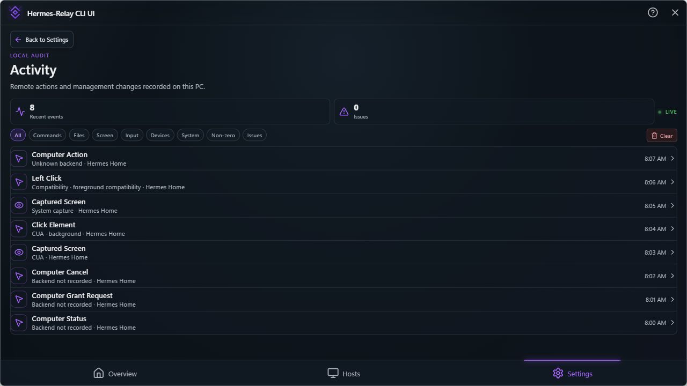
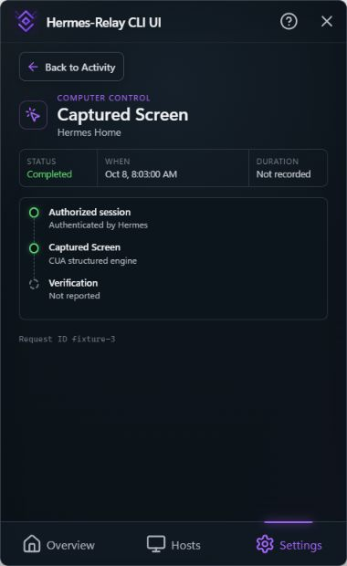

# Desktop Activity backend labels (#682)

The Activity list and event timeline previously treated every value other than
`cua` as compatibility input, and defaulted absent dispatch to background.
The correction renders only evidence recorded on each event. It does not infer
an earlier event's backend from the currently selected engine or rewrite logs.

| Recorded backend | List | Event timeline |
|---|---|---|
| `cua`, `cua_driver` | CUA | CUA structured engine |
| `system_capture` | System capture | System capture |
| `legacy_compat` | Compatibility | Windows input · Compatibility |
| Absent | Backend not recorded | Backend not recorded |
| Unrecognized | Unknown backend | Unknown backend |

Dispatch is appended only when present. Status, grant, and cancel entries may
legitimately record neither backend nor dispatch. Both CUA values remain valid
in existing logs; `cua_driver` is now included in the audit entry type.

## Verification

- Four presentation regressions fail with the previous formatter and pass with
  the correction; audit redaction and outcome tests remain passing.
- Full desktop suite: 205 passed, one opt-in native test skipped.
- CLI type-check/build and production tray frontend build pass.
- Canonical website screenshots were recaptured; all five images were unchanged.
  The source fingerprint now includes the label formatter. Its regression test,
  website asset checks, and full website build pass.
- Opt-in Windows CUA lane passes using Driver 0.28.2, including click, set-value,
  scroll, fresh snapshots, one-use rejection, and labels for the returned backend.
- Rendered the actual tray React Activity list and event timeline in the local
  browser preview, with sanitized fixture records and CUA selected. Checked
  1280×720 and the shipped main window size, 380×620. The fixture config replaces
  only demo data, initial navigation, and the native visibility hook.
- This is browser rendering of the actual tray components plus a native driver
  test. It is not an installed Tauri-shell or reporter-machine certification.

The separate #680 token follow-up covers hexadecimal generations beyond nine;
this label change does not claim to correct token validation.






## Reproduce the UI check

From `desktop`, install the tray dependencies and run:

```powershell
npm --prefix tray run dev -- --config scripts/vite.computer-activity.config.mjs
```

Open `http://127.0.0.1:1422`. Select the CUA snapshot, system capture, and status
records and verify their event timelines. No live profile or installed daemon
is used by this preview.
