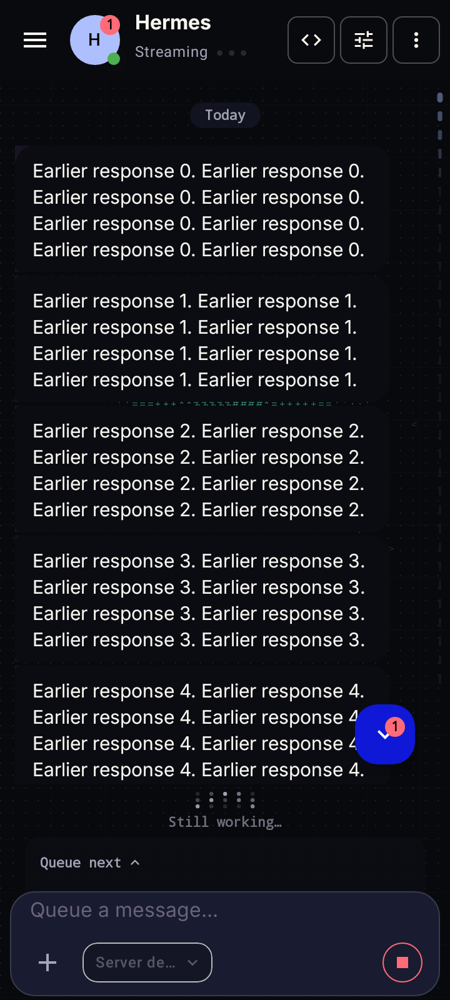
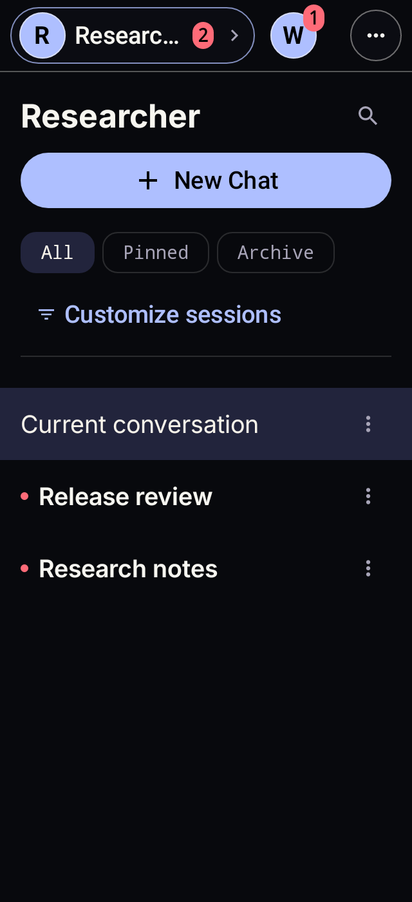

# Chat notification and unread-state verification

Background alerts retain the connection, profile, and durable conversation that
owns the turn. Permission defaults refresh after resume, successful detached
turns may notify, and errors/interruption never produce a detached success alert.
Unread receipts remain independent of notification permission and preserve read
state through replay. Official profile identity is captured before navigation;
avatars use the existing upstream profile asset cache.

## Rendered evidence

These are production Compose surfaces with synthetic data rendered through
Robolectric API 34. They are host-side layout evidence, not physical-device proof.

- Chat: 360 x 800 dp, dark theme. Progress remains above the composer while
  reading earlier messages, and the header shows another conversation's unread reply.
- Drawer and profile shelf: 320 x 700 dp, dark theme, 1.3 font scale. Unread
  conversations have a marker and stronger title weight; profile counts remain legible.

## Regression lanes

The focused Android CI and local prepush selections include unread-store,
checkpoint, notification identity/intent, permission-default, navigation, and
rendered composer/drawer regressions. Gateway fixture coverage distinguishes
successful, failed, and interrupted terminal envelopes; current-upstream
conformance validates the corresponding message-completion contract.

Physical verification remains a separate step: background Clarify delivery,
reply delivery and tap routing across conversations/profiles, unread persistence,
locked-screen behavior, reconnect, and composer placement with the keyboard.
Installation/version checks alone do not establish these behaviors.
